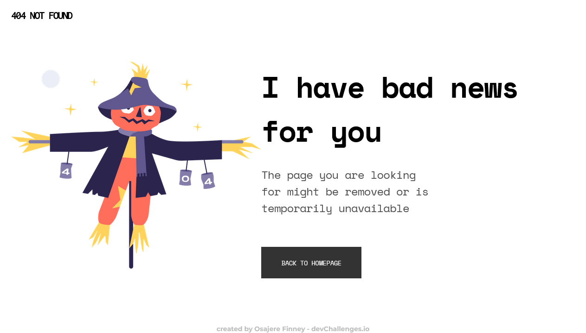
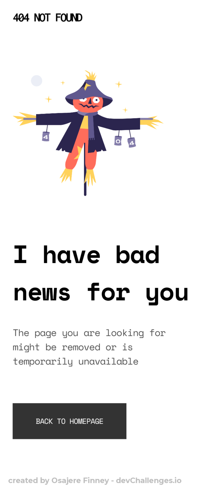

<!-- Please update value in the {}  -->

<h1 align="center">{404 not found}</h1>

   Solution for a challenge from  <a href="http://devchallenges.io" target="_blank">Devchallenges.io</a>.

  <h3>
    <a href="https://{your-demo-link.your-domain}">
      Live site
    </a>
     | 
    <a href="https://devchallenges.io/challenges/wBunSb7FPrIepJZAg0sY">
      Challenge
    </a>
  </h3>

<!-- TABLE OF CONTENTS -->

## Table of Contents 

- [Overview](#overview)
  - [Built With](#built-with)
- [Features](#features)
- [Contact](#contact)
- [Acknowledgements](#acknowledgements)

<!-- OVERVIEW -->

## Overview

### Desktop Design Screenshot
 

 ### Mobile Design Screenshot

<!-- - Where can I see your demo?
- What was your experience?
- What have you learned/improved?
- Your wisdom? :) -->

## Features

This application/site was created as a submission to a [DevChallenges](https://devchallenges.io/challenges) challenge. The [challenge](https://devchallenges.io/challenges/wBunSb7FPrIepJZAg0sY) was to build an application to complete the given user stories.

## Acknowledgements
Thanks to Tech newbies forum for making me know about the dev challenge platform and helped me ouut with thing i didn't know about tackling this challenge.
<!-- This section should list any articles or add-ons/plugins that helps you to complete the project. This is optional but it will help you in the future. For exmpale -->

- [Steps to replicate a design with only HTML and CSS](https://devchallenges-blogs.web.app/how-to-replicate-design/)
- [Marked - a markdown parser](https://github.com/chjj/marked)

## Contact

<!-- - Website [your-website.com](https://{your-web-site-link}) -->
- Frontend Mentor - [@Finney06](https://www.frontendmentor.io/profile/Finney06)
- Twitter - [@Osa_finney](https://www.twitter.com/@Osa_finney)
- Github - [@finney06](https://github.com/Finney06)
